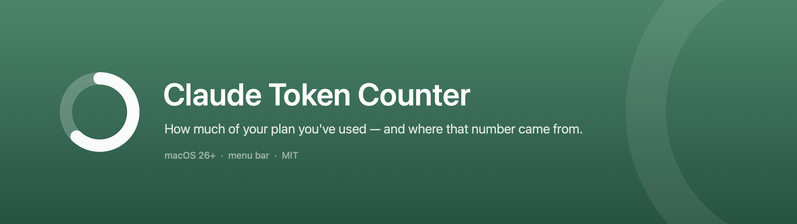
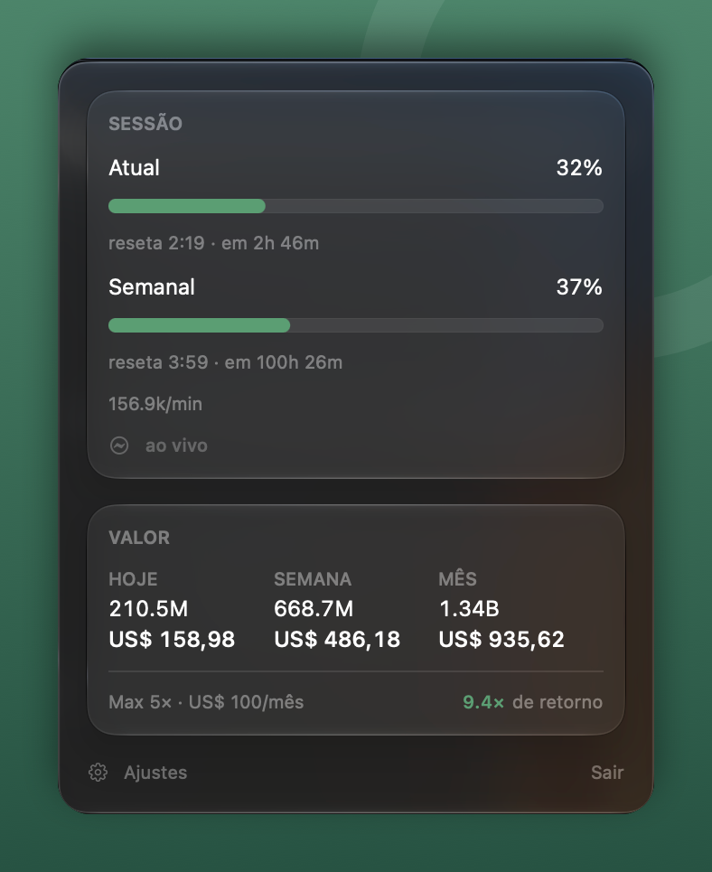

# Claude Token Counter

A macOS menu bar app that shows how much of your Claude Code plan you've used —
and, more importantly, **where that number came from**.

```
◐ 81%   ← how much of the 5-hour window is spent, live
```



## Why it exists

Claude Code keeps a cache of your usage in `~/.claude.json`. That cache **only
updates while Claude Code is running**.

In a real measurement taken during development, the cache was **18 hours
stale**: it reported 35% of the 5-hour window used when the true figure was
**81%**. An app reading only that cache would tell you there's plenty of room
left at exactly the moment you're about to hit the ceiling.

This app fetches the numbers live, and when it can't, it **says so** instead of
showing an old value with a fresh face.

## Three sources, and the screen always says which one is in use

| Source | When | What the screen shows |
|---|---|---|
| **Live** | Toggle on, valid credential | `live` |
| **Claude Code cache** | Toggle off, or the fetch failed | `Claude Code cache · 20m ago`, or **`stale cache · 18h old`** in amber past one hour |
| **Derived from history** | No cache — fresh install | `estimated from your history` |

A number without provenance is a number you can't trust. Each failure state gets
its own sentence, because the way out differs: an expired credential asks you to
run Claude Code; a network failure asks you to wait.

## What it shows

- **Session (5h) and weekly**, with reset times and countdowns
- **Per-model weekly windows**, when your account has any with usage
- **API-equivalent value** — tokens and USD for today, this week and this month,
  priced per model *and per date*; a model with no known price never becomes
  $0.00, the total is marked partial instead
- **Plan return multiple**: how far the month's usage covers the subscription
- **Per-project usage**, in the Projects tab — which project spent what today,
  this week or this month. Usage recorded before the app started noting project
  origin shows as a footnote, and disappears as it ages out of the 90-day window.

## Alerts

The app can notify you before you hit the ceiling, and when a window resets and
capacity comes back. Off by default — a notification is an interruption, and an
interruption shouldn't be anything's initial state.

Thresholds (80/90/95) and windows are configurable in Settings.

**Alerts only fire on live data.** Built on the cache, an alert would be wrong in
both directions — and the worse direction is silence while you blow past the
ceiling. Turn alerts on without live fetching and the app tells you once, with a
button to fix it, rather than notifying you badly.

## Install

### DMG

Download the `.dmg` from the [latest release](../../releases/latest), open it,
and drag the app onto the `Applications` folder in the window.

The app is ad-hoc signed, not notarized by Apple. macOS will block it on first
launch — the DMG makes installation familiar, but it doesn't change that. Two
ways through:

```bash
xattr -d com.apple.quarantine /Applications/ClaudeTokenCounter.app
```

Or, without the terminal: try to open it, let macOS block it, then go to **System
Settings → Privacy & Security**, scroll to the notice, and click **Open Anyway**.

The old trick of right-clicking and choosing **Open** no longer works: Apple
removed that bypass in macOS 15, and this app requires macOS 26.

This isn't a security workaround — it's what macOS asks for any app distributed
outside the App Store without a paid developer account. The code is all here for
you to check, and building it yourself takes under ten seconds.

### From source

No Xcode needed — just Command Line Tools with Swift 6.4+.

```bash
git clone https://github.com/Ulpio/ClaudeTokenCounter.git
cd ClaudeTokenCounter
./Scripts/bundle.sh --install    # builds and copies to /Applications
```

Building locally also skips the Gatekeeper step: an app you assembled yourself
never carries the quarantine flag.

Requires **macOS 26+**. The published binary is universal — it runs on Apple
Silicon and on the Intel Macs that still reach macOS 26.

## Languages

English and Brazilian Portuguese, following your system language. Any other
locale falls back to English.

## Privacy

The app runs entirely on your machine. No server, no telemetry, no analytics.

**Local reads:** `~/.claude/projects/**/*.jsonl` (read-only, for tokens and
cost) and `~/.claude.json` (the usage cache).

**Keychain:** the `Claude Code-credentials` item, which belongs to Claude Code.
By default the app reads **only** the `rateLimitTier` field, to detect your plan.

The `accessToken` is read only when you turn on **Settings → Usage numbers →
Fetch live**, and even then through a single point in the code, behind a check on
that toggle. With it off, the field is never extracted.

The `refreshToken` **has no reader anywhere in the app** — and the guarantee is
structural, not a promise: the `ClaudeCredentials` type has no field to hold it.
The app never refreshes OAuth, because rewriting Claude Code's keychain item
could invalidate its session.

**Network:** a single call, `GET https://api.anthropic.com/api/oauth/usage`,
every 5 minutes, and only with live fetching on. It's the same call Claude Code
itself makes.

## Development

```bash
./Scripts/test.sh          # core suite (216 tests) + string catalog check
./Scripts/check-strings.sh # keys vs. catalogs, and loose literals in views
./Scripts/icon.sh          # draws the .icns, installer art, banner and social
                           # card; given a capture path, frames the screenshot
./Scripts/bundle.sh        # assembles dist/ClaudeTokenCounter.app (--install)
./Scripts/dmg.sh           # builds dist/ClaudeTokenCounter-<version>.dmg
./Scripts/release.sh       # tests, packages, builds the DMG, publishes (--dry-run)
./Scripts/update.sh        # warns when the installed app is older than the repo
```

`bundle.sh` signs with the first code-signing identity it finds, and falls back
to ad-hoc when there is none, so a clone without a certificate builds exactly as
before. The identity is not about Gatekeeper, which rejects both equally: an
ad-hoc app's designated requirement is the binary's hash, so every rebuild is a
new app to the Keychain and every "Always Allow" dies with the previous binary.
Signed with an identity, the requirement is the bundle ID plus the certificate,
and it survives recompiling.

Released artifacts are always ad-hoc (`release.sh` passes `--adhoc`). A
development certificate buys no trust on someone else's machine and would embed
the signer's email in every published binary.

`CFBundleVersion` carries `<version>+<commit>`, which is what lets `update.sh`
tell whether the app in `/Applications` matches the code. `update.sh --schedule`
installs a daily launchd agent that notifies you when they drift apart; it never
installs anything on its own.

**Plain `swift test` does not work** in this toolchain: Command Line Tools ships
swift-testing but doesn't wire it up — the macro plugin sits outside the plugin
path, and `Testing.framework` / `lib_TestingInterop.dylib` sit outside the test
bundle's rpath. `Scripts/test.sh` injects all three and forwards arguments, so
`./Scripts/test.sh --filter PricingTable` works normally.

For the same reason the app doesn't use `@State`: in the macOS 26 SDK it's a
SwiftUI macro and the `SwiftUIMacros` plugin only ships with Xcode. Redraw comes
from `@Observable`, whose plugin does exist in CLT.

Code comments are in Portuguese, by choice — it's the maintainers' language, and
`CCUsageCore` is mostly comments explaining decisions.

### Architecture

Two targets. `CCUsageCore` doesn't import SwiftUI — all logic is testable
without instantiating a window.

The live API response and the `~/.claude.json` cache are **the same payload**:
the second is a written copy of the first. So there's one decoder
(`UsageReportDecoder`) fed by two origins, and a pure function
(`UsageSourcePolicy`) picks between them. Nothing downstream knows where the
number came from — except the one UI line whose job is to say.

The contract read is the `limits[]` array, not the payload's top-level keys:
those are internal codenames that rotate every product cycle, and it's `limits[]`
that carries the per-model windows with display names.

`AlertPolicy` is pure too, and takes no clock: given the same sequence of
snapshots it produces the same alerts, which is what makes rearming and
anti-repetition testable at all. The `Alert` type carries the fact — which
window, what percentage — never the sentence. Wording lives in the UI target,
alongside every other user-facing string, which is what allows localizing the app
without localizing the core.

The mark is a ring that fills as the 5-hour window advances, and it exists once:
`GaugeGeometry`, in the core, builds the path. The menu bar draws it with the
live fraction, and `Scripts/icon.swift` — compiled against that same file —
freezes it at 62% for the app icon.

## Contributing

Issues and pull requests are welcome. [CONTRIBUTING.md](CONTRIBUTING.md) covers
building without Xcode, why `swift test` doesn't work in this toolchain, the
string-catalog check that will fail your PR, and the privacy invariants a change
near the Keychain has to preserve.

Bug reports: please include the provenance line the panel shows. A wrong
percentage means something very different depending on whether it came from
`live` or a stale cache, and it's the first thing anyone debugging will ask for.

## Credits

Inspired by [CodexBar](https://github.com/steipete/CodexBar) by Peter
Steinberger, which showed the usage endpoint existed and was worth using.

## License

MIT — see [LICENSE](LICENSE).
